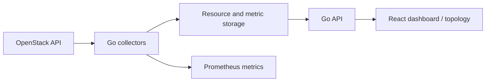

# OpenStack observability: a code tour

Follow the path from infrastructure APIs to a usable resource and topology view:
collect → persist → query → visualize.

| Concern | Entry point |
| --- | --- |
| Provider calls and retry behavior | `backend/pkg/openstack/` |
| Resource and metric collection | `backend/internal/services/collector/` |
| Persistence | `backend/internal/models/`, `backend/internal/services/storage/` |
| Graph relationships and path finding | `backend/internal/services/topology/` |
| Authenticated API and event stream | `backend/internal/api/` |
| Resource, metric and topology views | `frontend/src/pages/`, `frontend/src/components/` |



## Reproduce backend checks

The default branch is `001-openstack-monitoring`. From the repository root:

```sh
cd backend
go build -mod=readonly ./...
go test -mod=readonly ./internal/... ./pkg/...
```

Both commands passed during the 2026-09-11 portfolio review. The tested scope is local
handlers, collector helpers and topology logic. Database integration and performance
tests under `backend/tests/` require separate setup and were not used as production evidence.

## Frontend build

From `frontend/`, run `npm ci --ignore-scripts --no-audit --no-fund` followed by
`npm run build`. The lockfile was repaired and this build passed on 2026-09-11,
with existing unused-variable and React hook-dependency lint warnings. The older
React Scripts dependency tree also emits deprecation warnings; build success is
not a dependency-security audit or a browser end-to-end test.

A live system needs a database
and an OpenStack environment. See [README](../README.md). Never publish provider
credentials or real resource exports as fixtures.
